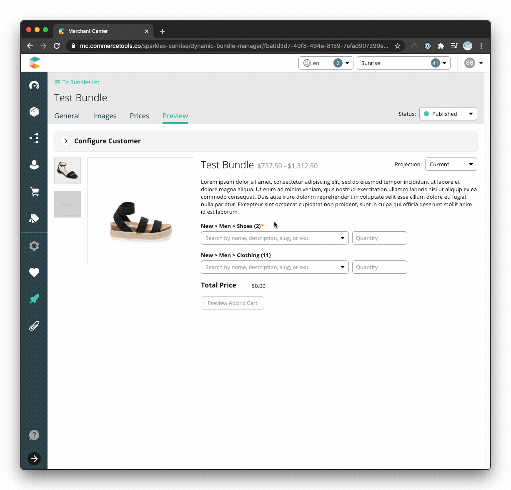

# Dynamic Bundles

## Table of contents
<!-- START doctoc generated TOC please keep comment here to allow auto update -->
<!-- DON'T EDIT THIS SECTION, INSTEAD RE-RUN doctoc TO UPDATE -->

- [Overview](#overview)
- [Technology](#technology)
- [Features](#features)
  - [Bundles List](#bundles-list)
  - [Bundle Creation](#bundle-creation)
  - [Bundle Details](#bundle-details)
    - [General](#general)
    - [Images](#images)
    - [Prices](#prices)
    - [Preview](#preview)
      - [Fixed Price Bundle with Additional Charge Component](#fixed-price-bundle-with-additional-charge-component)
      - [Dynamic Price Bundle](#dynamic-price-bundle)
- [Architecture](#architecture)
  - [Product](#product)
  - [Product Types](#product-types)
    - [DynamicBundleParent](#dynamicbundleparent)
    - [DynamicBundleChildCategory](#dynamicbundlechildcategory)
    - [Sample Bundle](#sample-bundle)
- [Configuration](#configuration)
- [Installation](#installation)
- [Development](#development)
  - [Start the development server](#start-the-development-server)
  - [Troubleshooting](#troubleshooting)
    - [`graphql_error.invalid_token` error](#graphql_errorinvalid_token-error)
    - [Do's and Don'ts](#dos-and-donts)
  - [Linting & Formatting](#linting--formatting)
    - [Formatting code](#formatting-code)
    - [Linting code](#linting-code)
      - [Linting GraphQL Queries](#linting-graphql-queries)
      - [Generating CTP GraphQL schema](#generating-ctp-graphql-schema)
  - [Git Hooks](#git-hooks)
- [Tests](#tests)
- [Build & Deployment](#build--deployment)
  - [Registration with Merchant Center](#registration-with-merchant-center)
    - [Configuration Values](#configuration-values)
- [Complete the Solution: Your Implementation Responsibilities](#complete-the-solution-your-implementation-responsibilities)
- [Support](#support)

<!-- END doctoc generated TOC please keep comment here to allow auto update -->

## Overview

Dynamic bundles allow for more complex bundling scenarios. Dynamic bundles
specify a group of products where the user can select one product variant.
Common use-cases include mix-&-match offers, where a user can select six craft
beers to build a six-pack or build an entire outfit choosing a shirt, jacket,
pants, and tie. Another common use-case is composite products, where the user
can configure the final product, for example building a computer by choosing a
CPU, GPU, RAM, and HDD.

Where a [static bundle](../static/index.md) points to specific SKUs, a dynamic
bundle points to specific categories and stores business rules around each
category. Pricing for the dynamic bundle can be a fixed amount or change based
on the bundle selections.

Dynamic bundles require a custom UI for the customer to make their selections
and additional code when adding to the cart and checking out. The system
presented handles some common use-cases, however companies often have unique
business rules that need to be considered. To accommodate these rules, the code
can be modified to meet the needs of the store.

Dynamic bundles are achieved by creating a new product with a specific
[type](https://docs.commercetools.com/http-api-projects-productTypes) that
references all the product groups and business rules within the bundle.

The Merchant Center
[custom application](https://docs.commercetools.com/custom-applications/) in
this solution assists merchandisers in creating and managing dynamic bundles.

## Technology

- [ReactJS](https://reactjs.org/)
- [Apollo](https://www.apollographql.com/docs/react/) &
  [GraphQL](https://graphql.org/learn/)
- [Merchant Center Application Kit](https://docs.commercetools.com/custom-applications/)
- [UI Kit](https://uikit.commercetools.com/?path=/story/introduction--getting-started) -
  Merchant Center component library
- [Yarn](https://classic.yarnpkg.com/en/docs/getting-started) - Package manager
- [Jest](https://jestjs.io/docs/en/getting-started) - Test runner
- [Enzyme](https://enzymejs.github.io/enzyme/) - React testing utility
- [Prettier](https://prettier.io/docs/en/index.html) - Code formatter
- [ESLint](https://eslint.org/docs/user-guide/getting-started) - JS, CSS, and
  GraphQL linter

## Features

### Bundles List

The landing page for the static bundles custom application is a list displaying
the static bundles within the commercetools project.


- Pagination
  - [Default page size](https://github.com/commercetools/mc-custom-app-bundles/blob/8664055fa790e88c3f681a0a08057d46fe176707/packages/bundles-core/components/bundles-table/constants.js#L4)
    of 30,
  - Displayed when the number of static bundles exceeds the page size
- Sorting
  - Sortable columns are Name, Price, and Last Modified
  - [Initial sort](https://github.com/commercetools/mc-custom-app-bundles/blob/8664055fa790e88c3f681a0a08057d46fe176707/packages/bundles-core/components/bundles-table/constants.js#L5)
    is Last Modified in descending order (most recent to least recent bundles)
- Search for a bundle using
  [product projections search](https://docs.commercetools.com/http-api-projects-products-search)
- Filter
  - By bundle price type (fixed or dynamic)
  - By category within bundle

### Bundle Creation


- Single step to create a static bundle with basic information
- Search for a category using
  [GraphQL category search](https://docs.commercetools.com/graphql-api#supported-entities)
- Automatic slug creation based on the name of the bundle, which can be modified
  to suit your needs
- Only displays additional charge component option when bundle is a fixed price

### Bundle Details

Manage bundle information, add images, and determine pricing strategies.

- Manage the bundle's published status
- Delete unpublished bundle

#### General

Edit the bundle's general information.


#### Images


- Add image(s) directly to the bundle via Merchant Center
- Remove images
- Manage other image properties via Merchant Center

#### Prices

View the prices of the bundle components in various scopes to determine its
prices.


- View bundle component prices in different
  [price scopes](https://docs.commercetools.com/http-api-projects-products#scopedprice)
  - Displays the min and max prices of each category for the selected scope
- Add a price via Merchant Center
- View prices via Merchant Center

_Note_: Dynamically priced bundles require a price defined (i.e. USD \$0) to be
added to a cart.

#### Preview

A reference product detail page (PDP) for merchandisers to visualize the bundle.

- Configurable
  - Modify the price scope to see the bundle as different customers
  - View each product projection
- Search for and select a product variant from each bundle category
- Form validation based on bundle configuration (min/max quantities for bundle
  components)
- Preview add to cart action
- Displays bundle price based on the bundle's price type
  - Fixed price
    - Calculates additional charge components by adding price of selected
      variant to the base fixed price
  - Dynamic price
    - Displays price range of bundle based on bundle categories
    - Calculates price of bundle by summing price of selected product variant
      multiplied by its quantity

##### Fixed Price Bundle with Additional Charge Component


##### Dynamic Price Bundle


## Architecture

### Product

A bundle is a commercetools
[product](https://docs.commercetools.com/http-api-projects-products) with only a
master variant. The bundle components are stored as attributes of the master
variant in accordance with the bundle [product types](#product-types).

### Product Types

#### DynamicBundleParent

- **categories** - Array of
  [DynamicBundleChildCategory](#dynamicbundlechildcategory) - Required\
  The components of the bundle.
- **category-search** - Array of String - Required\
  The bundle category IDs that are used to filter the bundle list.
- **min-quantity** - Number\
  The minimum quantity of the bundle that must be added to a cart.
- **max-quantity** - Number\
  The maximum quantity of the bundle that may be added to a cart.
- **dynamic-price** - Boolean\
  Determines whether the bundle's price is determined by the selected product variants
  or has a fixed price.

#### DynamicBundleChildCategory

A bundle component, which is a
[product category](https://docs.commercetools.com/http-api-projects-categories)
specifically created for use with the dynamic bundles solution.

- **category-ref** - Category
  [Reference](https://docs.commercetools.com/http-api-types.html#reference) -
  Required\
  A reference to the bundle category.
- **category-path** - String - Required\
  The path of the bundle category. Used for display purposes within the category
  search when viewing a bundle.
- **min-quantity** - Number\
  The minimum quantity of the selected product variant from this category that must
  be added to the bundle.
- **max-quantity** - Number\
  The maximum quantity of the selected product variant from this category that may
  be added to the bundle.
- **additional-charge** - Boolean\
  Determines whether adding a product variant from this category to the bundle results
  in an increase to the bundle price. Only available as a selection when the bundle
  is statically priced.

_Note:_ If any of the underlying values of the selected category change, the
attribute values will not be updated until the bundle component in question is
re-selected and saved on the bundle with the updated values.

\


#### Sample Bundle

<details>
  <summary>Click to expand</summary>
   
```json
{
  "id": "fba0d3d7-40f8-494e-8159-7efad907299e",
  "version": 16,
  "productType": {
    "typeId": "product-type",
    "id": "d7a7078d-77fb-452c-9f89-c4f3ff580cd3",
    "obj": {
      "id": "d7a7078d-77fb-452c-9f89-c4f3ff580cd3",
      "version": 8,
      "createdAt": "2019-10-09T13:21:33.210Z",
      "lastModifiedAt": "2019-12-05T17:33:08.919Z",
      "lastModifiedBy": {
        "isPlatformClient": true,
        "user": {
          "typeId": "user",
          "id": "c9065b8c-aae2-45e6-988d-b453869396be"
        }
      },
      "createdBy": {
        "clientId": "kkwLptxStfpV2ga6cx1_iKLu",
        "isPlatformClient": false
      },
      "name": "DynamicBundleParent",
      "description": "A dynamic bundle of product categories",
      "classifier": "Complex",
      "attributes": [
        {
          "name": "categories",
          "label": { "en": "Categories" },
          "isRequired": false,
          "type": {
            "name": "set",
            "elementType": {
              "name": "nested",
              "typeReference": {
                "typeId": "product-type",
                "id": "126dfa1e-bb88-4ca8-b4c6-90809a427ccd"
              }
            }
          },
          "attributeConstraint": "None",
          "isSearchable": false,
          "inputHint": "SingleLine",
          "displayGroup": "Other"
        },
        {
          "name": "min-quantity",
          "label": { "de": "", "en": "Minimum Quantity" },
          "inputTip": { "de": "", "en": "" },
          "isRequired": false,
          "type": { "name": "number" },
          "attributeConstraint": "None",
          "isSearchable": true,
          "inputHint": "SingleLine",
          "displayGroup": "Other"
        },
        {
          "name": "max-quantity",
          "label": { "de": "", "en": "Max Quantity" },
          "inputTip": { "de": "", "en": "" },
          "isRequired": false,
          "type": { "name": "number" },
          "attributeConstraint": "None",
          "isSearchable": true,
          "inputHint": "SingleLine",
          "displayGroup": "Other"
        },
        {
          "name": "dynamic-price",
          "label": { "de": "", "en": "Dynamic Price" },
          "inputTip": { "de": "", "en": "" },
          "isRequired": false,
          "type": { "name": "boolean" },
          "attributeConstraint": "None",
          "isSearchable": true,
          "inputHint": "SingleLine",
          "displayGroup": "Other"
        },
        {
          "name": "category-search",
          "label": { "de": "", "en": "Category (Search)" },
          "inputTip": { "de": "", "en": "" },
          "isRequired": false,
          "type": { "name": "set", "elementType": { "name": "text" } },
          "attributeConstraint": "None",
          "isSearchable": true,
          "inputHint": "SingleLine",
          "displayGroup": "Other"
        }
      ],
      "key": "dynamic-bundle-parent"
    }
  },
  "name": { "en": "Test Bundle" },
  "description": {
    "en": "Lorem ipsum dolor sit amet, consectetur adipiscing elit, sed do eiusmod tempor incididunt ut labore et dolore magna aliqua. Ut enim ad minim veniam, quis nostrud exercitation ullamco laboris nisi ut aliquip ex ea commodo consequat. Duis aute irure dolor in reprehenderit in voluptate velit esse cillum dolore eu fugiat nulla pariatur. Excepteur sint occaecat cupidatat non proident, sunt in culpa qui officia deserunt mollit anim id est laborum."
  },
  "categories": [],
  "categoryOrderHints": {},
  "slug": { "en": "test-bundle-1" },
  "masterVariant": {
    "id": 1,
    "prices": [
      {
        "value": {
          "type": "centPrecision",
          "currencyCode": "USD",
          "centAmount": 0,
          "fractionDigits": 2
        },
        "id": "6c49d1a0-410d-4ff3-9f4f-03f11b21efe3"
      }
    ],
    "images": [
      {
        "url": "https://3e82993a4eb41d4c4033-d629e744ec32fa52597723d397b63314.ssl.cf1.rackcdn.com/sandals+black+again-rYgI68Y4.jpeg",
        "dimensions": { "w": 262, "h": 192 }
      },
      {
        "url": "https://3e82993a4eb41d4c4033-d629e744ec32fa52597723d397b63314.ssl.cf1.rackcdn.com/sandals+black-5VEcMfOQ.jpeg",
        "dimensions": { "w": 225, "h": 225 }
      },
      {
        "url": "https://via.placeholder.com/250",
        "dimensions": { "w": 250, "h": 250 }
      }
    ],
    "attributes": [
      {
        "name": "categories",
        "value": [
          [
            {
              "name": "category-ref",
              "value": {
                "typeId": "category",
                "id": "33e6235b-def0-4ed6-aaf9-b23e8f364eae"
              }
            },
            { "name": "category-path", "value": "New > Men > Shoes (2)" },
            { "name": "min-quantity", "value": 2 }
          ],
          [
            {
              "name": "category-ref",
              "value": {
                "typeId": "category",
                "id": "c93cedb4-464e-41ee-8031-2d7e8de2294f"
              }
            },
            { "name": "category-path", "value": "New > Men > Clothing (11)" },
            { "name": "max-quantity", "value": 2 }
          ]
        ]
      },
      {
        "name": "category-search",
        "value": [
          "33e6235b-def0-4ed6-aaf9-b23e8f364eae",
          "c93cedb4-464e-41ee-8031-2d7e8de2294f"
        ]
      },
      { "name": "dynamic-price", "value": true },
      { "name": "min-quantity", "value": 2 },
      { "name": "max-quantity", "value": 3 }
    ],
    "assets": []
  },
  "variants": [],
  "searchKeywords": {},
  "hasStagedChanges": false,
  "published": true,
  "taxCategory": {
    "typeId": "tax-category",
    "id": "a1af21d4-444c-409d-82a6-c3163b28b8e9",
    "obj": {
      "id": "a1af21d4-444c-409d-82a6-c3163b28b8e9",
      "version": 1,
      "createdAt": "2019-05-31T14:01:54.035Z",
      "lastModifiedAt": "2019-05-31T14:01:54.035Z",
      "lastModifiedBy": {
        "clientId": "AS2q4W4InSWREs5JQBltxP5V",
        "isPlatformClient": false
      },
      "createdBy": {
        "clientId": "AS2q4W4InSWREs5JQBltxP5V",
        "isPlatformClient": false
      },
      "name": "standard",
      "rates": [
        {
          "name": "20% incl.",
          "amount": 0.2,
          "includedInPrice": true,
          "country": "AT",
          "id": "8us0Y-Ay",
          "subRates": []
        },
        {
          "name": "10% incl.",
          "amount": 0.1,
          "includedInPrice": true,
          "country": "US",
          "id": "EGg9RL8e",
          "subRates": []
        },
        {
          "name": "19% incl.",
          "amount": 0.19,
          "includedInPrice": true,
          "country": "DE",
          "id": "FIHSMRUP",
          "subRates": []
        }
      ],
      "key": "standard"
    }
  },
  "createdAt": "2020-01-21T13:54:37.110Z",
  "lastModifiedAt": "2020-07-31T14:19:21.668Z"
}
```
</details>

## Configuration

A
[terraform script](https://github.com/commercetools/platform-extension-gallery/tree/master/packages/platform-extension-dynamic-bundles#terraform)
initializes the commercetools project for using dynamic bundles. Prior to using
dynamic bundles, this terraform script must be executed against the
commercetools project and will deploy:

- [Dynamic Bundle Product Type](https://github.com/commercetools/platform-extension-gallery/blob/master/packages/platform-extension-dynamic-bundles/resourceDefinitions/productTypes/dynamic-bundle-parent.json)
  – For creating new bundles.
- [Nested Product Type](https://github.com/commercetools/platform-extension-gallery/blob/master/packages/platform-extension-dynamic-bundles/resourceDefinitions/productTypes/dynamic-bundle-child-category.json)
  – For managing 1...n category references from a dynamic bundle and
  configuration data.

## Installation

Simply run `yarn` from the repository root to install the application's
dependencies.

## Development

### Start the development server

Run the following command to start the development server and launch the
application:

```shell
yarn start
```

If this is the first time running the application locally, create an `env.json`
file at the static bundles root directory using `env.local.json` as an example.
Based on your [region](https://docs.commercetools.com/http-api.html#regions),
you may find it necessary to modify the values of `frontendHost`, `mcApiUrl`,
and `location`.

### Troubleshooting

#### `graphql_error.invalid_token` error

Log out of [Merchant Center](https://mc.us-central1.gcp.commercetools.com/). Log
back in, then return to the custom application and reload.

#### Do's and Don'ts

- **Don't** use the application development login screen to authenticate.
- **Do** make sure you are logged in to Merchant Center before developing or
  running a custom application.

### Linting & Formatting

#### Formatting code

Run the following command to format JS, CSS, JSON and GraphQL files

```shell
yarn format
```

#### Linting code

Run the following command to lint JS, CSS, and GraphQL files

```shell
yarn lint
```

##### Linting GraphQL Queries

A prerequisite for linting GraphQL queries is generating a `schema.graphql`
file, which contains the Types exposed by CTP API. Every time the API introduces
new Types, Queries or Mutations, the local `schema.graphql` must be updated.

##### Generating CTP GraphQL schema

1. If you haven't done so already, create an API client under
   `Settings -> Developer Settings` in Merchant Center for your project
2. Generate an access token using the
   [Client Credentials flow](https://docs.commercetools.com/http-api-authorization#client-credentials-flow)
3. Export both your Merchant Center project key and generated access token as
   environment variables
4. Retrieve schema with `graphql-cli`

```shell
export PROJECT_KEY={project_key}
export AUTH_TOKEN={access_token}
npx graphql-cli get-schema
```

### Git Hooks

Git hooks are configured using
[Husky](https://github.com/typicode/husky/blob/master/DOCS.md). The root
workspace runs all workspace hooks using Lerna
([example repository](https://github.com/sudo-suhas/lint-staged-multi-pkg)). The
hooks are configured as follows:

- **Pre-commit**: JS, CSS, and GraphQL files are linted (ESLint/Stylelint) and
  formatted (Prettier). Fixes are automatically added to Git.
- **Commit Message**: Commit messages are linted against the
  [conventional commit format](https://www.conventionalcommits.org) using
  commitlint

## Tests

Run the following command to run the tests:

```shell
yarn test
```

To run the tests in watch mode:

```shell
yarn test:watch
```

To run the tests with coverage:

```shell
yarn test:coverage
```

## Build & Deployment

Run the following command to build the
[production bundles](https://docs.commercetools.com/custom-applications/deployment/production-build)
with webpack:

```bash
yarn build
```

Please check for deployment examples documentation [here](https://docs.commercetools.com/custom-applications/deployment-examples).
 
 NOTE: Be sure to set the env vars for the placeholders in [custom-application-config.mjs](https://github.com/commercetools/commercetools-bundles-starter/tree/master/packages/bundles-dynamic/custom-application-config.mjs).
- Example: For AWS deployment, env variables can be set using the file [env.aws](./../../packages/bundles-dynamic/.env.aws). For other deployments, duplicate the file and set values accordingly.

For more information on how to use .env files, check [official documentation](https://docs.commercetools.com/custom-applications/api-reference/cli#using-dotenv-files).

### Registration with Merchant Center

After deploying the custom application, it needs to be
[registered](https://docs.commercetools.com/custom-applications/register-applications/configuring-a-custom-application)
with a Merchant Center project.

#### Configuration Values

- **Main Route Path**: dynamic-bundle-manager
- **Link Permissions**: Manage Products, View Products


## Complete the Solution: Your Implementation Responsibilities

To complete the bundles solution, you will first need to supply a product detail
page (PDP) for the dynamic bundle products in your frontend implementation. The
custom application provides an
[example PDP](https://github.com/commercetools/mc-custom-app-bundles/tree/master/packages/bundles-dynamic/src/components/bundle-preview)
as a reference along with corresponding
[documentation](https://github.com/commercetools/mc-custom-app-bundles/tree/master/packages/bundles-dynamic#development)
for the necessary API calls. The UX for displaying the bundle components will
depend on your specific use case.

For dynamically priced bundles, you will need to provide the pricing algorithm
for the bundles. The example PDP
[sums the price](https://github.com/commercetools/mc-custom-app-bundles/blob/9784c3d83fba2a0bf6a29aca5bf68357ba97569c/packages/bundles-dynamic/src/components/bundle-preview/bundle-preview.js#L215)
of the selected product variants
[multiplied by the quantity](https://github.com/commercetools/mc-custom-app-bundles/blob/9784c3d83fba2a0bf6a29aca5bf68357ba97569c/packages/bundles-dynamic/src/components/bundle-preview/category-product-field.js#L54)
of each.



For statically priced bundles with components that are designated with an
additional charge, you will need to provide the algorithm for determining what
that additional charge is and updating the bundle's price accordingly.


## Support

Please create an [issue](https://github.com/commercetools/commercetools-bundles-starter/issues) in the repository for all support requests related to
the dynamic bundles solution.
