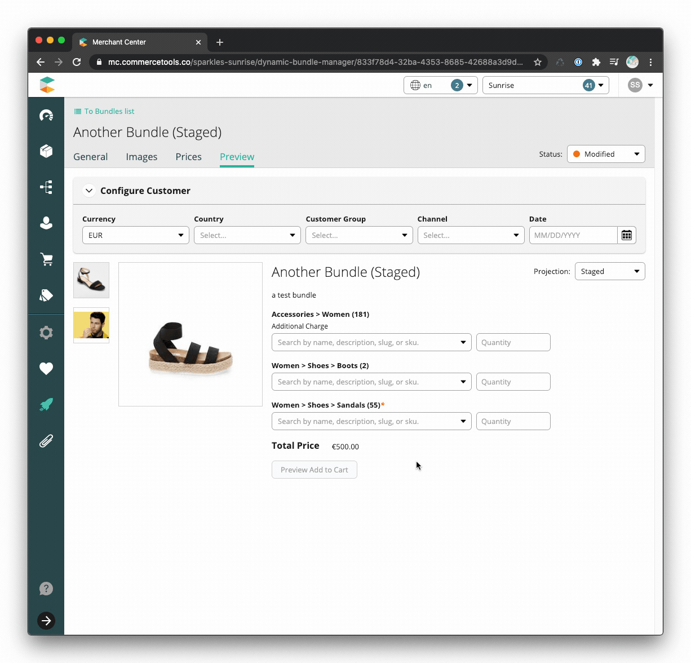

# Dynamic Bundles

## Overview

Dynamic bundles allow for more complex bundling scenarios. Dynamic bundles
specify a group of products where the user can select one product variant.
Common use-cases include mix-&-match offers, where a user can select six craft
beers to build a six-pack or build an entire outfit choosing a shirt, jacket,
pants, and tie. Another common use-case is composite products, where the user
can configure the final product, for example building a computer by choosing a
CPU, GPU, RAM, and HDD.

Where a [static bundle](../static/index.md) points to specific SKUs, a dynamic
bundle points to specific categories and stores business rules around each
category. Pricing for the dynamic bundle can be a fixed amount or change based
on the bundle selections.

Dynamic bundles require a custom UI for the customer to make their selections
and additional code when adding to the cart and checking out. The system
presented handles some common use-cases, however companies often have unique
business rules that need to be considered. To accommodate these rules, the code
can be modified to meet the needs of the store.

Dynamic bundles are achieved by creating a new product with a specific
[type](https://docs.commercetools.com/http-api-projects-productTypes) that
references all the product groups and business rules within the bundle.

The Merchant Center
[custom application](https://docs.commercetools.com/custom-applications/) in
this solution assists merchandisers in creating and managing dynamic bundles.

## Technology

- [ReactJS](https://reactjs.org/)
- [Apollo](https://www.apollographql.com/docs/react/) &
  [GraphQL](https://graphql.org/learn/)
- [Merchant Center Application Kit](https://docs.commercetools.com/custom-applications/)
- [UI Kit](https://uikit.commercetools.com/?path=/story/introduction--getting-started) -
  Merchant Center component library
- [Yarn](https://classic.yarnpkg.com/en/docs/getting-started) - Package manager
- [Jest](https://jestjs.io/docs/en/getting-started) - Test runner
- [Enzyme](https://enzymejs.github.io/enzyme/) - React testing utility
- [Prettier](https://prettier.io/docs/en/index.html) - Code formatter
- [ESLint](https://eslint.org/docs/user-guide/getting-started) - JS, CSS, and
  GraphQL linter

## Configuration

A
[terraform script](https://github.com/commercetools/platform-extension-gallery/tree/master/packages/platform-extension-dynamic-bundles#terraform)
initializes the commercetools project for using dynamic bundles. Prior to using
dynamic bundles, this terraform script must be executed against the
commercetools project and will deploy:

- [Dynamic Bundle Product Type](https://github.com/commercetools/platform-extension-gallery/blob/master/packages/platform-extension-dynamic-bundles/resourceDefinitions/productTypes/dynamic-bundle-parent.json)
  – For creating new bundles.
- [Nested Product Type](https://github.com/commercetools/platform-extension-gallery/blob/master/packages/platform-extension-dynamic-bundles/resourceDefinitions/productTypes/dynamic-bundle-child-category.json)
  – For managing 1...n category references from a dynamic bundle and
  configuration data.

## Installation

Simply run `yarn` from the repository root to install the application's
dependencies.

The application has a dependency on the private package
`@commercetools-us-ps/mc-app-core`, which requires an
[npm auth token](https://docs.npmjs.com/about-authentication-tokens). To acquire
an auth token, request access to the `@commercetools-us-ps` scope from the US
Professional Services team.
[Create](https://docs.npmjs.com/creating-and-viewing-authentication-tokens) the
auth token then run the following commands to configure npm. This will allow the
installation of the private package.

```shell
export NPM_TOKEN=xxxx-xxxx-xxxx-xxxx
npm config set '//registry.npmjs.org/:_authToken' "${NPM_TOKEN}"
```

## Development

### Start the development server

Run the following command to start the development server and launch the
application:

```shell
yarn start
```

If this is the first time running the application locally, create an `env.json`
file at the static bundles root directory using `env.local.json` as an example.
Based on your [region](https://docs.commercetools.com/http-api.html#regions),
you may find it necessary to modify the values of `frontendHost`, `mcApiUrl`,
and `location`.

### Troubleshooting

#### `graphql_error.invalid_token` error

Log out of [Merchant Center](https://mc.commercetools.co/). Log back in, then
return to the custom application and reload.

#### Do's and Don'ts

- **Don't** use the application development login screen to authenticate.
- **Do** make sure you are logged in to Merchant Center before developing or
  running a custom application.

### Linting & Formatting

#### Formatting code

Run the following command to format JS, CSS, JSON and GraphQL files

```shell
yarn format
```

#### Linting code

Run the following command to lint JS, CSS, and GraphQL files

```shell
yarn lint
```

##### Linting GraphQL Queries

A prerequisite for linting GraphQL queries is generating a `schema.graphql`
file, which contains the Types exposed by CTP API. Every time the API introduces
new Types, Queries or Mutations, the local `schema.graphql` must be updated.

##### Generating CTP GraphQL schema

1. If you haven't done so already, create an API client under
   `Settings -> Developer Settings` in Merchant Center for your project
2. Generate an access token using the
   [Client Credentials flow](https://docs.commercetools.com/http-api-authorization#client-credentials-flow)
3. Export both your Merchant Center project key and generated access token as
   environment variables
4. Retrieve schema with `graphql-cli`

```shell
export PROJECT_KEY={project_key}
export AUTH_TOKEN={access_token}
npx graphql-cli get-schema
```

### Git Hooks

Git hooks are configured using
[Husky](https://github.com/typicode/husky/blob/master/DOCS.md). The root
workspace runs all workspace hooks using Lerna
([example repository](https://github.com/sudo-suhas/lint-staged-multi-pkg)). The
hooks are configured as follows:

- **Pre-commit**: JS, CSS, and GraphQL files are linted (ESLint/Stylelint) and
  formatted (Prettier). Fixes are automatically added to Git.
- **Commit Message**: Commit messages are linted against the
  [conventional commit format](https://www.conventionalcommits.org) using
  commitlint

## Tests

Run the following command to run the tests:

```shell
yarn test
```

To run the tests in watch mode:

```shell
yarn test:watch
```

To run the tests with coverage:

```shell
yarn test:coverage
```

## Build & Deployment

Run the following command to build the
[production bundles](https://docs.commercetools.com/custom-applications/deployment/production-build)
with webpack:

```bash
yarn build
```

The application includes configuration for both AWS (S3 & CloudFront) and
Firebase serverless deployments built with `mc-script compile-html`.

- [Firebase](https://appkit.commercetools.com/deployment/example-firebase):
  `yarn compile-html:firebase`
- [AWS - S3 & CloudFront](https://appkit.commercetools.com/deployment/example-aws-s3-cloudfront):
  `yarn compile-html:aws`

For either deployment option, the corresponding `production-{cloud}.env.json`
and `production-{cloud}.headers.json` files must be modified with values that
match your deployment environment.

### Registration with Merchant Center

After deploying the custom application, it needs to be
[registered](https://docs.commercetools.com/custom-applications/register-applications/configuring-a-custom-application)
with a Merchant Center project.

#### Configuration Values

- **Main Route Path**: dynamic-bundle-manager
- **Link Permissions**: Manage Products, View Products


## Complete the Solution: Your Implementation Responsibilities

To complete the bundles solution, you will first need to supply a product detail
page (PDP) for the dynamic bundle products in your frontend implementation. The
custom application provides an
[example PDP](https://github.com/commercetools/mc-custom-app-bundles/tree/master/packages/bundles-dynamic/src/components/bundle-preview)
as a reference along with corresponding
[documentation](https://github.com/commercetools/mc-custom-app-bundles/tree/master/packages/bundles-dynamic#development)
for the necessary API calls. The UX for displaying the bundle components will
depend on your specific use case.

For dynamically priced bundles, you will need to provide the pricing algorithm
for the bundles. The example PDP
[sums the price](https://github.com/commercetools/mc-custom-app-bundles/blob/9784c3d83fba2a0bf6a29aca5bf68357ba97569c/packages/bundles-dynamic/src/components/bundle-preview/bundle-preview.js#L215)
of the selected product variants
[multiplied by the quantity](https://github.com/commercetools/mc-custom-app-bundles/blob/9784c3d83fba2a0bf6a29aca5bf68357ba97569c/packages/bundles-dynamic/src/components/bundle-preview/category-product-field.js#L54)
of each.


For statically priced bundles with components that are designated with an
additional charge, you will need to provide the algorithm for determining what
that additional charge is and updating the bundle's price accordingly.


