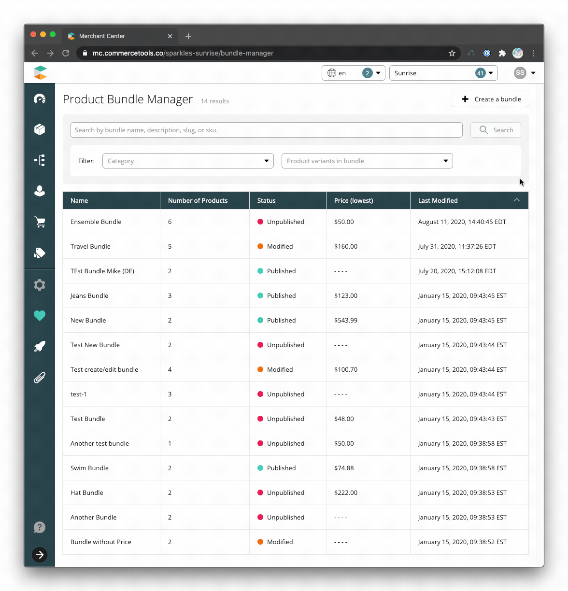
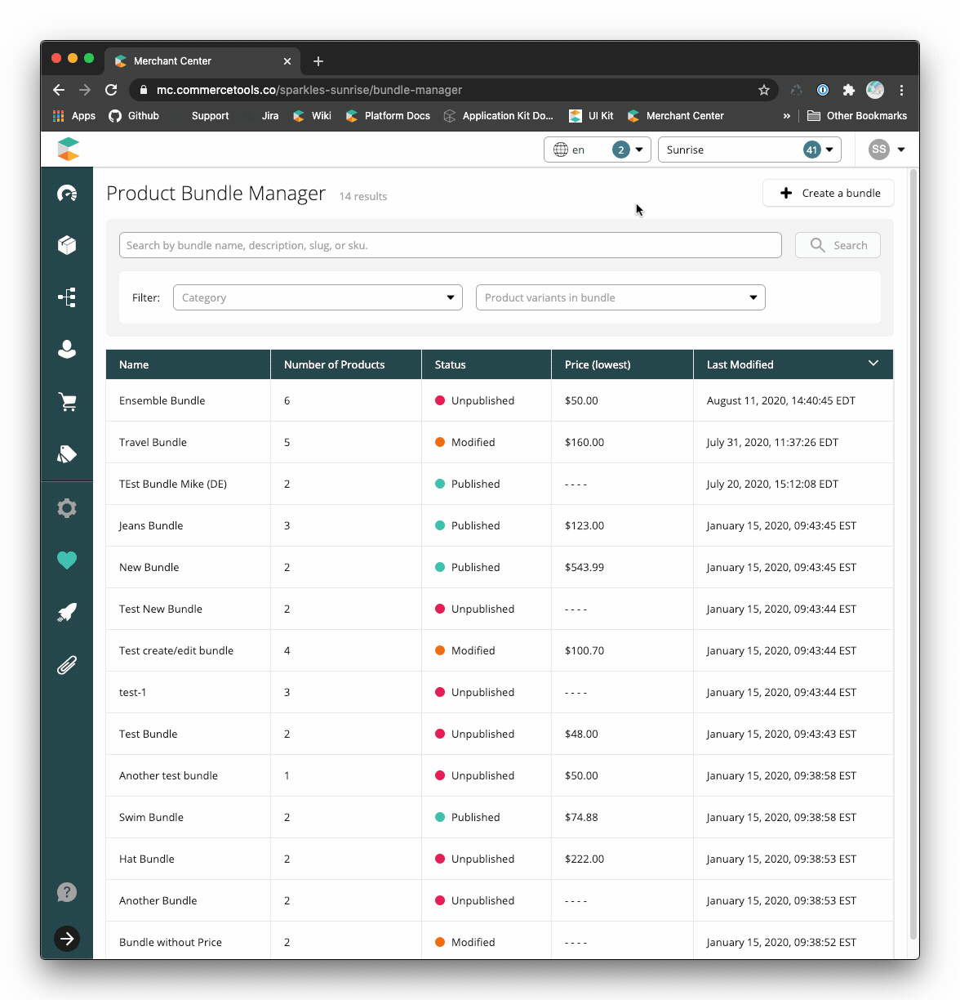
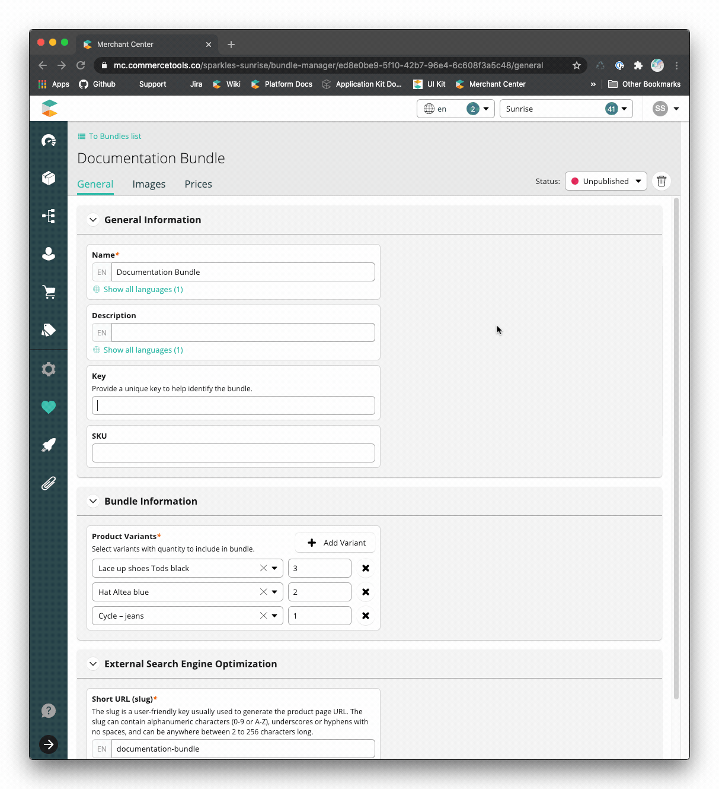
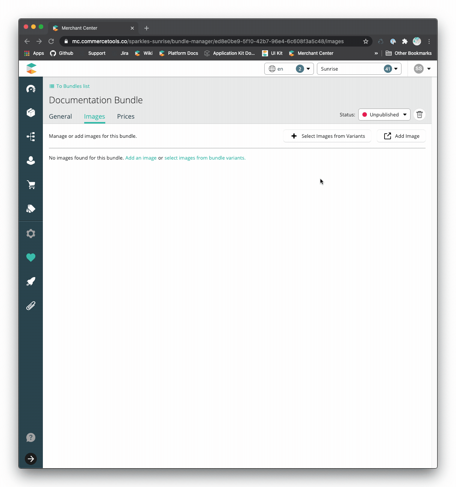
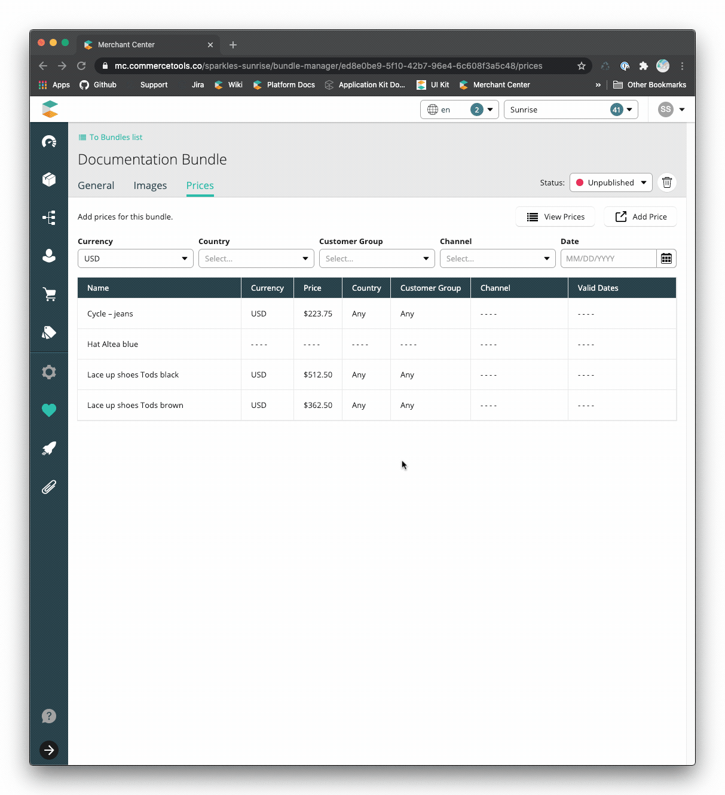
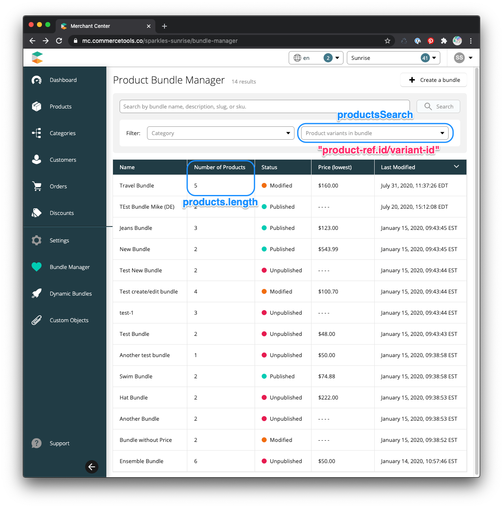
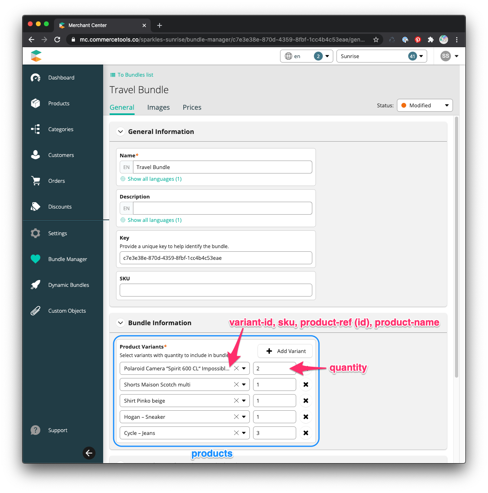
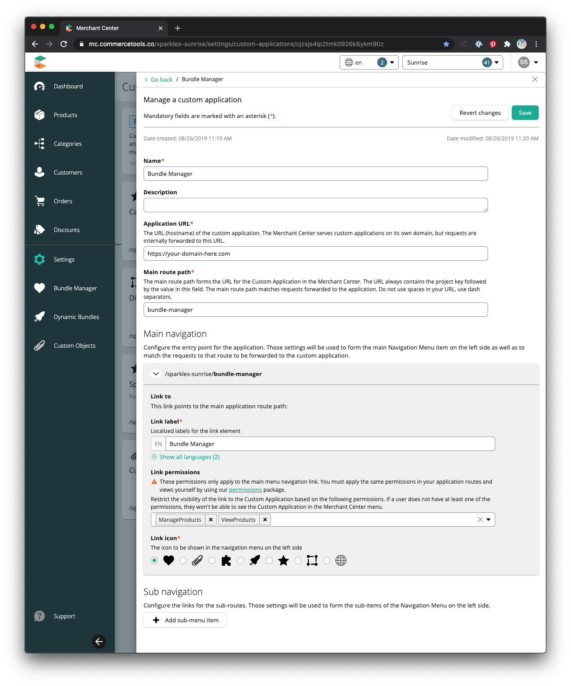

# Static Bundles

## Table of contents
<!-- START doctoc generated TOC please keep comment here to allow auto update -->
<!-- DON'T EDIT THIS SECTION, INSTEAD RE-RUN doctoc TO UPDATE -->

- [Overview](#overview)
- [Technology](#technology)
- [Features](#features)
  - [Bundles List](#bundles-list)
  - [Bundle Creation](#bundle-creation)
  - [Bundle Details](#bundle-details)
    - [General](#general)
    - [Images](#images)
    - [Prices](#prices)
- [Architecture](#architecture)
  - [Product](#product)
  - [Product Types](#product-types)
    - [StaticBundleParent](#staticbundleparent)
    - [StaticBundleChildVariant](#staticbundlechildvariant)
    - [Sample Bundle](#sample-bundle)
- [Configuration](#configuration)
- [Installation](#installation)
- [Development](#development)
  - [Start the development server](#start-the-development-server)
  - [Troubleshooting](#troubleshooting)
    - [`graphql_error.invalid_token` error](#graphql_errorinvalid_token-error)
    - [Do's and Don'ts](#dos-and-donts)
  - [Linting & Formatting](#linting--formatting)
    - [Formatting code](#formatting-code)
    - [Linting code](#linting-code)
      - [Linting GraphQL Queries](#linting-graphql-queries)
      - [Generating CTP GraphQL schema](#generating-ctp-graphql-schema)
  - [Git Hooks](#git-hooks)
- [Tests](#tests)
- [Build & Deployment](#build--deployment)
  - [Registration with Merchant Center](#registration-with-merchant-center)
    - [Configuration Values](#configuration-values)
- [Complete the Solution: Your Implementation Responsibilities](#complete-the-solution-your-implementation-responsibilities)
- [Support](#support)

<!-- END doctoc generated TOC please keep comment here to allow auto update -->

## Overview

The static bundles solution handles the concept of putting together multiple
related products for a total-sum price. An example static bundle is selling a
camera, bag, and SD card for a single bundled price. The customer purchases a
single bundle and then receives two or more distinct inventory items as selected
by merchandising.

This process has been achieved by creating a new [product](https://docs.commercetools.com/api/projects/products) with a specific
[type](https://docs.commercetools.com/http-api-projects-productTypes) that
references all the items within the bundle. On adding this new item to the cart,
an API extension [platform-extension-static-bundles](https://github.com/commercetools/commercetools-bundles-starter/tree/master/packages/platform-extension-static-bundles)
is executed for cart requests to manage the child items during checkout. The
final order includes the bundle items with pricing and a list of child line
items for fulfillment.

The Merchant Center
[custom application](https://docs.commercetools.com/custom-applications/) in
this solution assists merchandisers in creating and managing static bundles.

## Technology

- [ReactJS](https://reactjs.org/)
- [Apollo](https://www.apollographql.com/docs/react/) &
  [GraphQL](https://graphql.org/learn/)
- [Merchant Center Application Kit](https://docs.commercetools.com/custom-applications/)
- [UI Kit](https://uikit.commercetools.com/?path=/story/introduction--getting-started) -
  Merchant Center component library
- [Yarn](https://classic.yarnpkg.com/en/docs/getting-started) - Package manager
- [Jest](https://jestjs.io/docs/en/getting-started) - Test runner
- [Enzyme](https://enzymejs.github.io/enzyme/) - React testing utility
- [Prettier](https://prettier.io/docs/en/index.html) - Code formatter
- [ESLint](https://eslint.org/docs/user-guide/getting-started) - JS, CSS, and
  GraphQL linter

## Features

### Bundles List

The landing page for the static bundles custom application is a list displaying
the static bundles within the commercetools project.



- Pagination
  - [Default page size](https://github.com/commercetools/mc-custom-app-bundles/blob/8664055fa790e88c3f681a0a08057d46fe176707/packages/bundles-core/components/bundles-table/constants.js#L4)
    of 30,
  - Displayed when the number of static bundles exceeds the page size
- Sorting
  - Sortable columns are Name, Price, and Last Modified
  - [Initial sort](https://github.com/commercetools/mc-custom-app-bundles/blob/8664055fa790e88c3f681a0a08057d46fe176707/packages/bundles-core/components/bundles-table/constants.js#L5)
    is Last Modified in descending order (most recent to least recent bundles)
- Search for a bundle using
  [product projections search](https://docs.commercetools.com/http-api-projects-products-search)
- Filter
  - By bundle category (must be set on bundle from Merchant Center Products
    application. Ex: `https://mc.us-central1.gcp.commercetools.com/{projectKey}/products/{bundleId}`)
  - By product variant within bundle

### Bundle Creation



- Single step to create a static bundle with basic information
- Search for a product variant using
  [product projections search](https://docs.commercetools.com/http-api-projects-products-search)
- Automatic slug creation based on the name of the bundle, which can be modified
  to suit your needs

### Bundle Details

Manage bundle information, add images, and determine pricing strategies.

- Manage the bundle's published status
- Delete unpublished bundle

#### General

Edit the bundle's general information.



#### Images



- Add image(s) to the bundle from the images of the bundle's components (product
  variants)
- Add image(s) directly to the bundle via Merchant Center
- Remove images
- Manage other image properties via Merchant Center

#### Prices

View the prices of the bundle components in various scopes to determine its
prices.



- View bundle component prices in different
  [price scopes](https://docs.commercetools.com/http-api-projects-products#scopedprice)
- Add a price via Merchant Center
- View prices via Merchant Center

## Architecture

### Product

A bundle is a commercetools
[product](https://docs.commercetools.com/http-api-projects-products) with only a
master variant. The bundle components are stored as attributes of the master
variant in accordance with the bundle [product types](#product-types).

### Product Types

#### StaticBundleParent

- **products** - Array of
  [StaticBundleChildVariant](#staticbundlechildvariant) - Required\
  The components of the bundle
- **productsSearch** - Array of String - Required\
  The bundle components stringified as `{productId}/{variantId}` and used to filter
  the bundle list

#### StaticBundleChildVariant

A bundle component, which is a
[product variant](https://docs.commercetools.com/http-api-projects-products.html#productvariant).

- **variant-id** - Number - Required\
  The ID of the product variant.
- **quantity** - Number - Required\
  The number of the component within the bundle.
- **sku** - String\
  The SKU of the product variant. Used for display purposes within the product search
  when viewing a bundle.
- **product-ref** - Product
  [Reference](https://docs.commercetools.com/http-api-types.html#reference) \
  A reference to the product associated with the bundle product variant. Used to
  create the product search value.
- **product-name** -
  [LocalizedString](https://docs.commercetools.com/http-api-types.html#localizedstring)
  \
  The name of the product associated with the bundle product variant. Used for display
  purposes within the product search when viewing a bundle.

_Note:_ If any of the underlying values of the selected product variant or
product change, the attribute values will not be updated until the bundle
component in question is re-selected and saved on the bundle with the new
values.

\


#### Sample Bundle

<details>
  <summary>Click to expand</summary>
   
```json
{
  "id": "c7e3e38e-870d-4359-8fbf-1cc4b4c53eae",
  "version": 74,
  "productType": {
    "typeId": "product-type",
    "id": "1a1b24be-ae4a-4b98-a2cd-3225d5e7ce04",
    "obj": {
      "id": "1a1b24be-ae4a-4b98-a2cd-3225d5e7ce04",
      "version": 6,
      "createdAt": "2019-08-26T14:38:06.189Z",
      "lastModifiedAt": "2019-10-09T13:13:52.005Z",
      "lastModifiedBy": {
        "isPlatformClient": true,
        "user": {
          "typeId": "user",
          "id": "f2303e24-a06c-458c-8986-363b8cf208c4"
        }
      },
      "createdBy": {
        "clientId": "RftQf1edB6sYPMh7uq8GisJ_",
        "isPlatformClient": false
      },
      "name": "StaticBundleParent",
      "description": "A static bundle of product variants",
      "classifier": "Complex",
      "attributes": [
        {
          "name": "products",
          "label": { "en": "Products" },
          "isRequired": false,
          "type": {
            "name": "set",
            "elementType": {
              "name": "nested",
              "typeReference": {
                "typeId": "product-type",
                "id": "25583dd7-4177-4c3d-908b-a5030ca2d029"
              }
            }
          },
          "attributeConstraint": "None",
          "isSearchable": true,
          "inputHint": "SingleLine",
          "displayGroup": "Other"
        },
        {
          "name": "productSearch",
          "label": { "en": "Products (Search)" },
          "isRequired": false,
          "type": { "name": "set", "elementType": { "name": "text" } },
          "attributeConstraint": "None",
          "isSearchable": true,
          "inputHint": "SingleLine",
          "displayGroup": "Other"
        }
      ],
      "key": "static-bundle-parent"
    }
  },
  "name": { "en": "Travel Bundle", "de": "Noch ein Bundle" },
  "description": {
    "de": "Alles was Sie brauchen, um zu wandern.",
    "en": "Everything you need to wander."
  },
  "categories": [],
  "categoryOrderHints": {},
  "slug": { "en": "travel-bundle" },
  "masterVariant": {
    "id": 1,
    "prices": [
      {
        "value": {
          "type": "centPrecision",
          "currencyCode": "USD",
          "centAmount": 17339,
          "fractionDigits": 2
        },
        "id": "d7f33a98-5f4f-4490-819b-0e4a396d4ed2"
      },
      {
        "value": {
          "type": "centPrecision",
          "currencyCode": "USD",
          "centAmount": 16000,
          "fractionDigits": 2
        },
        "id": "06e1f3be-fbb6-4125-bb18-61fe310d2ef9",
        "customerGroup": {
          "typeId": "customer-group",
          "id": "182489ba-57a0-486b-ab91-c3bc7d30976b",
          "obj": {
            "id": "182489ba-57a0-486b-ab91-c3bc7d30976b",
            "version": 2,
            "createdAt": "2019-05-31T14:02:03.178Z",
            "lastModifiedAt": "2019-09-27T16:33:43.807Z",
            "lastModifiedBy": {
              "isPlatformClient": true,
              "user": {
                "typeId": "user",
                "id": "f2303e24-a06c-458c-8986-363b8cf208c4"
              }
            },
            "createdBy": {
              "clientId": "AS2q4W4InSWREs5JQBltxP5V",
              "isPlatformClient": false
            },
            "name": "Platinum",
            "key": "platinum"
          }
        }
      }
    ],
    "images": [
      {
        "url": "https://s3-eu-west-1.amazonaws.com/commercetools-maximilian/products/072599_1_medium.jpg",
        "dimensions": { "w": 0, "h": 0 }
      },
      {
        "url": "https://s3-eu-west-1.amazonaws.com/commercetools-maximilian/products/084058_1_large.jpg",
        "dimensions": { "w": 0, "h": 0 }
      },
      {
        "url": "https://s3-eu-west-1.amazonaws.com/commercetools-maximilian/products/085391_1_large.jpg",
        "dimensions": { "w": 0, "h": 0 }
      },
      {
        "url": "https://s3-eu-west-1.amazonaws.com/commercetools-maximilian/products/085314_1_medium.jpg",
        "dimensions": { "w": 0, "h": 0 }
      }
    ],
    "attributes": [
      {
        "name": "products",
        "value": [
          [
            { "value": 1, "name": "variant-id" },
            { "value": "A0E200000002ABW", "name": "sku" },
            { "value": 2, "name": "quantity" },
            {
              "value": {
                "typeId": "product",
                "id": "52b4bf82-4050-4dfc-be35-75c1621cd63b"
              },
              "name": "product-ref"
            },
            {
              "value": {
                "de": "Polaroidkamera „Spirit 600 CL“ Impossible schwarz",
                "en": "Polaroid Camera “Spirit 600 CL“ Impossible black"
              },
              "name": "product-name"
            }
          ],
          [
            { "value": 2, "name": "variant-id" },
            { "value": "M0E20000000EH7O", "name": "sku" },
            { "value": 1, "name": "quantity" },
            {
              "value": {
                "typeId": "product",
                "id": "038d1661-f61e-4b01-976c-0dfb523056ba"
              },
              "name": "product-ref"
            },
            {
              "value": {
                "de": "Shorts Maison Scotch multi",
                "en": "Shorts Maison Scotch multi"
              },
              "name": "product-name"
            }
          ],
          [
            { "value": 7, "name": "variant-id" },
            { "value": "M0E20000000DJQB", "name": "sku" },
            { "value": 1, "name": "quantity" },
            {
              "value": {
                "typeId": "product",
                "id": "e999a590-0321-4956-bb87-cafb84b3c660"
              },
              "name": "product-ref"
            },
            {
              "value": { "en": "Shirt Pinko beige", "de": "Bluse Pinko beige" },
              "name": "product-name"
            }
          ],
          [
            { "value": 1, "name": "variant-id" },
            { "value": "M0E20000000F67V", "name": "sku" },
            { "value": 1, "name": "quantity" },
            {
              "value": {
                "typeId": "product",
                "id": "eb861953-7620-4c56-8f05-8e659af20e5a"
              },
              "name": "product-ref"
            },
            {
              "value": { "en": "Hogan – Sneaker", "de": "Hogan – Sneaker" },
              "name": "product-name"
            }
          ],
          [
            { "value": 7, "name": "variant-id" },
            { "value": "M0E20000000F753", "name": "sku" },
            { "value": 3, "name": "quantity" },
            {
              "value": {
                "typeId": "product",
                "id": "79ee9759-e37b-4b0c-b615-fa46dd2aa77b"
              },
              "name": "product-ref"
            },
            {
              "value": { "de": "Cycle – Jeans", "en": "Cycle – Jeans" },
              "name": "product-name"
            }
          ]
        ]
      },
      {
        "name": "productSearch",
        "value": [
          "52b4bf82-4050-4dfc-be35-75c1621cd63b/1",
          "038d1661-f61e-4b01-976c-0dfb523056ba/2",
          "e999a590-0321-4956-bb87-cafb84b3c660/7",
          "eb861953-7620-4c56-8f05-8e659af20e5a/1",
          "79ee9759-e37b-4b0c-b615-fa46dd2aa77b/7"
        ]
      }
    ],
    "assets": []
  },
  "variants": [],
  "searchKeywords": {},
  "hasStagedChanges": true,
  "published": true,
  "key": "c7e3e38e-870d-4359-8fbf-1cc4b4c53eae",
  "taxCategory": {
    "typeId": "tax-category",
    "id": "a1af21d4-444c-409d-82a6-c3163b28b8e9",
    "obj": {
      "id": "a1af21d4-444c-409d-82a6-c3163b28b8e9",
      "version": 1,
      "createdAt": "2019-05-31T14:01:54.035Z",
      "lastModifiedAt": "2019-05-31T14:01:54.035Z",
      "lastModifiedBy": {
        "clientId": "AS2q4W4InSWREs5JQBltxP5V",
        "isPlatformClient": false
      },
      "createdBy": {
        "clientId": "AS2q4W4InSWREs5JQBltxP5V",
        "isPlatformClient": false
      },
      "name": "standard",
      "rates": [
        {
          "name": "20% incl.",
          "amount": 0.2,
          "includedInPrice": true,
          "country": "AT",
          "id": "8us0Y-Ay",
          "subRates": []
        },
        {
          "name": "10% incl.",
          "amount": 0.1,
          "includedInPrice": true,
          "country": "US",
          "id": "EGg9RL8e",
          "subRates": []
        },
        {
          "name": "19% incl.",
          "amount": 0.19,
          "includedInPrice": true,
          "country": "DE",
          "id": "FIHSMRUP",
          "subRates": []
        }
      ],
      "key": "standard"
    }
  },
  "createdAt": "2019-08-29T18:25:03.256Z",
  "lastModifiedAt": "2020-07-31T15:37:26.719Z"
}
```

</details>

## Configuration

A [terraform script](https://github.com/commercetools/platform-extension-static-bundles#terraform)
initializes the commercetools project for using static bundles. Prior to using
static bundles, this terraform script must be executed against the commercetools
project and will deploy:

- [Static Bundle Product Type](https://github.com/commercetools/platform-extension-static-bundles/blob/master/resourceDefinitions/productTypes/static-bundle-parent.json)
  – For creating new bundles
- [Nested Product Type](https://github.com/commercetools/platform-extension-static-bundles/blob/master/resourceDefinitions/productTypes/static-bundle-child-variant.json)
  – For managing 1...n variant references from a static bundle
- [Custom Line Item Type](https://github.com/commercetools/platform-extension-static-bundles/blob/master/resourceDefinitions/types/static-bundle-parent-child-link.json)
  – For managing cart process

## Installation

Simply run `yarn` from the repository root to install the application's
dependencies.


## Development

### Start the development server

Run the following command to start the development server and launch the
application:

```shell
yarn start
```

If this is the first time running the application locally, open an [.env.local](packages/bundles-static/.env.local) file.
Based on your [region](https://docs.commercetools.com/http-api.html#regions),
you may find it necessary to modify the values in the env file.

### Troubleshooting

<!--prettier-ignore-start-->
#### `graphql_error.invalid_token` error
{: .no_toc }
<!--prettier-ignore-end-->

Log out of [Merchant Center](https://mc.us-central1.gcp.commercetools.com/). Log back in, then
return to the custom application and reload.

<!--prettier-ignore-start-->
#### Do's and Don'ts
{: .no_toc }
<!--prettier-ignore-end-->

- **Don't** use the application development login screen to authenticate.
- **Do** make sure you are logged in to Merchant Center before developing or
  running a custom application.

### Linting & Formatting

#### Formatting code

Run the following command to format JS, CSS, JSON and GraphQL files

```shell
yarn format
```

#### Linting code

Run the following command to lint JS, CSS, and GraphQL files

```shell
yarn lint
```

<!--prettier-ignore-start-->
##### Linting GraphQL Queries
{: .no_toc }
<!--prettier-ignore-end-->

A prerequisite for linting GraphQL queries is generating a `schema.graphql`
file, which contains the Types exposed by CTP API. Every time the API introduces
new Types, Queries or Mutations, the local `schema.graphql` must be updated.

<!--prettier-ignore-start-->
##### Generating CTP GraphQL schema
{: .no_toc }
<!--prettier-ignore-end-->

1. If you haven't done so already, create an API client under
   `Settings -> Developer Settings` in Merchant Center for your project
2. Generate an access token using the
   [Client Credentials flow](https://docs.commercetools.com/http-api-authorization#client-credentials-flow)
3. Export both your Merchant Center project key and generated access token as
   environment variables
4. Retrieve schema with `graphql-cli`

```shell
export PROJECT_KEY={project_key}
export AUTH_TOKEN={access_token}
npx graphql-cli get-schema
```

### Git Hooks

Git hooks are configured using
[Husky](https://github.com/typicode/husky/blob/master/DOCS.md). The root
workspace runs all workspace hooks using Lerna
([example repository](https://github.com/sudo-suhas/lint-staged-multi-pkg)). The
hooks are configured as follows:

- **Pre-commit**: JS, CSS, and GraphQL files are linted (ESLint/Stylelint) and
  formatted (Prettier). Fixes are automatically added to Git.
- **Commit Message**: Commit messages are linted against the
  [conventional commit format](https://www.conventionalcommits.org) using
  commitlint

## Tests

Run the following command to run the tests:

```shell
yarn test
```

To run the tests in watch mode:

```shell
yarn test:watch
```

To run the tests with coverage:

```shell
yarn test:coverage
```

## Build & Deployment

Run the following command to build the
[production bundles](https://docs.commercetools.com/custom-applications/deployment/production-build)
with webpack:

```bash
yarn build
```

Please check for deployment examples documentation [here](https://docs.commercetools.com/custom-applications/deployment-examples).
 
 NOTE: Be sure to set the env vars for the placeholders in [custom-application-config.mjs](https://github.com/commercetools/commercetools-bundles-starter/tree/master/packages/bundles-static/custom-application-config.mjs).
- Example: For AWS deployment, env variables can be set using the file [env.aws](./../../packages/bundles-static/.env.aws). For other deployments, duplicate the file and set values accordingly.

For more information on how to use .env files, check [official documentation](https://docs.commercetools.com/custom-applications/api-reference/cli#using-dotenv-files).

### Registration with Merchant Center

After deploying the custom application, it needs to be
[registered](https://docs.commercetools.com/custom-applications/register-applications/configuring-a-custom-application)
with a Merchant Center project.

<!--prettier-ignore-start-->
#### Configuration Values
{: .no_toc }
<!--prettier-ignore-end-->

- **Main Route Path**: bundle-manager
- **Link Permissions**: Manage Products, View Products



## Complete the Solution: Your Implementation Responsibilities

To complete the bundles solution, you will need to supply a product detail page
(PDP) for the static bundle products in your frontend implementation. Depending
on your use case, the PDP can utilize the bundle attributes to display the
individual bundle components, or you can rely on the bundle product's images to
convey that information. Using the latter option means that you can use the same
PDP implementation to display all of your commercetools products.

## Support

Please create an [issue](https://github.com/commercetools/commercetools-bundles-starter/issues) in the repository for all support requests related to
the static bundles solution.
