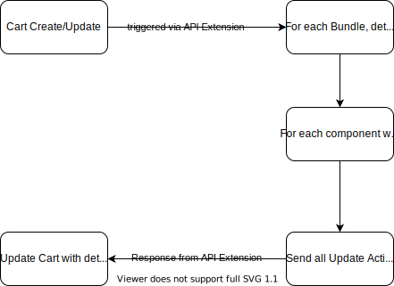

# Platform Extension - Static Bundles
{: .no_toc }

## Index
{: .no_toc .text-delta }

- TOC
{:toc}

## Application Overview

The static bundles solution handles the concept of putting together multiple related products for a total-sum price. An example static bundle is selling a camera, bag, and SD card for a single bundled price. The customer purchases a single bundle and then receives two or more distinct inventory items as selected by merchandising.

This is realized by two separate applications designed to work together.

### Merchant Center Custom application

The [Merchant Center custom application](https://commercetools.github.io/mc-custom-app-bundles/static/) in this solution assists merchandisers in creating and managing static bundles.

### API Extension

The API extension (this application) is executed during cart requests to validate the child items during checkout, for any line items that are bundles. The final order includes the bundle items with pricing and a list of child line items for fulfillment.

## Application Features

* Enables customers to add Static Bundles to their cart
* Automatic management of Bundle component Line Items
* Validation of Bundle component Line Items
* In-Memory caching of Static Bundle Product Types and Types
* Inventory of Bundle components is tracked, as they are added to the customer cart as line items priced at 0
* Deployed as a serverless function to ease scaling and reduce infrastructure management

## Technology Used

* [Babel](https://babeljs.io/)
* [Node Cache](https://github.com/node-cache/node-cache) - In-memory cache
* [Jest](https://jestjs.io/) - Testing framework
* [Nock](https://github.com/nock/nock) - Mocking library
* [Webpack](https://webpack.js.org/) - Bundler
* [ESLint](https://eslint.org/) - Code Linter
* [Prettier](https://prettier.io/) - Code Formatter
* [Terraform](https://www.terraform.io/) - Used to setup the ct project
* [commercetools Terraform Provider](https://github.com/labd/terraform-provider-commercetools)
* [Express](https://expressjs.com/) - Local development server


## Installation

### Prerequisites

#### NPM Token
{:.no_toc}

This application depends on NodeJS and the Yarn package manager to be installed.  The application has dependency on two private packages: `@commercetools-us-ps/platform-extension-core` and `@commercetools-us-ps/platform-extension-bundles`, which will require an npm auth token. To acquire an auth token, request access to the @commercetools-us-ps scope from the US Professional Services team. Create the auth token then run the following commands to configure npm/yarn. This will allow the installation of the private package.

```shell
export NPM_TOKEN=xxxx-xxxx-xxxx-xxxx
npm config set '//registry.npmjs.org/:_authToken' "${NPM_TOKEN}"
```

### Dependency Installation

This application's dependencies may be installed using yarn.  Simply run `yarn` or `yarn install`.  Once the dependencies are installed, you may begin configuring your installation.  

## Terraform

While it is not required to use Terraform to manage the Product Types and Types in your commercetools project, it can certainly help.  You may initialize Terraform using `yarn terraform:init`. This will require manually installing the [commercetools Terraform provider](https://github.com/labd/terraform-provider-commercetools) as well as terraform itself.  Once initialized, you may run `yarn terraform:plan` and `yarn terraform:apply` to plan and apply any configuration changes.  Terraform will make use of the same variables in `../config/default.env`, but will also load the env vars from `config/${NODE_ENV}.env`.  If you wish to not use Terraform, you ***must*** ensure that the Product Types and Types defined in the `../terraform/main.tf` are added to your project and are up to date.  The product types are also defiend as JSON in the [resourceDefinitions](../resourceDefinitions) directory.

## Configuration

In order to run this application, it must first be properly configured.  Ensure the following environment variables are defined prior to running the application.  These variables can either be exported, or can be stored in a `.env` file in the [`config`](../config) directory, using [`dotenv-webpack`](https://github.com/mrsteele/dotenv-webpack).  All supported configuration keys can be found in [`example.env`](../config/example.env) as well as in the section [below](#environment-variables). When running locally, configuration is supplied to the extension by Webpack in the following hierarchy:

- Default config values in [`default.env`](../config/env.default.json)
- Production/Development config values in `production.env` or `development.env`, determined by the value of the `NODE_ENV` environment variable

A deployed serverless function should rely on secrets/environment variables set in your provider (for example, the Lambda function's configuration). **Do not commit** `.env` files––`production.env` and `development.env` are included in [`.gitignore`](../.gitignore).

### Environment Variables

*  `commercetools_token_url` The commercetools Auth URL (e.g. https://auth.us-central1.gcp.commercetools.com/)
*  `commercetools_api_url` commercetools API URL (e.g. https://api.us-central1.gcp.commercetools.com/)
*  `commercetools_api_concurrency` commercetools API concurrency limit
*  `commercetools_client_id` A commercetools client ID
*  `commercetools_client_secret` The secret key for the commercetools client
*  `commercetools_project_key` The commercetools project key
*  `commercetools_scopes` The scopes used by the commercetools client
*  `cache_ttl` The in-memory cache's Time-To-Live

### Application Assumptions

The extension operates on the following assumptions:

- Bundles are not configurable, i.e. they have a fixed set of component products included in the cart any time a bundle parent product is added
- Bundle price is set on the parent product level and is not dynamic
- Bundle component line items always have a total price of 0

It also requires the following conditions to be met in order to function without code changes:

- The API extension is deployed to AWS Lambda (*TODO:* Support GCP, Azure, and Kubeless deployment)
- The [commercetools Terraform provider](https://github.com/labd/terraform-provider-commercetools) is manually installed if using Terraform
- The StaticBundleParent and StaticBundleChildVariant product types, and the StaticBundleParentChildLink custom type, (defined in [./terraform/main.tf](./terraform/main.tf)) are installed using Terraform (see below), or manually installed using the JSON representations in [`./resourceDefinitions`](./resourceDefinitions)
- Bundle products are built using the StaticBundleParent product type
- No custom types are assigned to bundle parent or child line items in the cart by another process

Bundle products may also be easiliy constructed and managed using the [companion Merchant Center custom application](https://commercetools.github.io/mc-custom-app-bundles/static/).

## Local Development

To begin a server to facilitate local development, simply run `yarn start`.  You will need to [add the extension](https://docs.commercetools.com/http-api-projects-api-extensions) to your commercetools project.  This requires the outside internet (at least commercetools) to access the local server.  We recommend using a tool like [ngrok](https://ngrok.com/) to do so.  Alternatively, you could use a tool like [Postman](https://www.postman.com/) to send requests to the local server.

## Tests

This application uses [Jest](https://jestjs.io) for its testing framework.  You may run the following command to run the tests:

```shell
yarn test
```

To run the tests in watch mode:

```shell
yarn test:watch
```

To run the tests with coverage:

```shell
yarn test:coverage
```

## Data Model


### Product Types

This application defines static bundles via several [Product Types](#https://docs.commercetools.com/http-api-projects-productTypes) in commercetools.  The parent Product Type is named `StaticBundleParent`.  Products created with this Product Type will be treated as static bundles.  The `StaticBundleChildVariant` Product Type defines several attributes to identify a particular variant of a product, along with a desired quantity.  `StaticBundleChildVariant` is used by `StaticBundleParent` as a [nested Product Type](https://docs.commercetools.com/tutorial-nested-types).


#### StaticBundleParent
{:.no_toc}

- **products** - Array of
  [StaticBundleChildVariant](#staticbundlechildvariant) - Required\
  The component products of the bundle
- **productsSearch** - Array of String - Required\
  The bundle components stringified as `{productId}/{variantId}` and used to filter
  the bundle list

#### StaticBundleChildVariant
{:.no_toc}

- **variant-id** - Number - Required\
  The ID of the product variant.
- **quantity** - Number - Required\
  The number of the component within the bundle.
- **sku** - String\
  The SKU of the product variant. Used for display purposes within the product search
  when viewing a bundle.
- **product-ref** - Product
  [Reference](https://docs.commercetools.com/http-api-types.html#reference) \
  A reference to the product associated with the bundle product variant. Used to
  create the product search value.
- **product-name** -
  [LocalizedString](https://docs.commercetools.com/http-api-types.html#localizedstring)
  \
  The name of the product associated with the bundle product variant. Used for display
  purposes within the product search when viewing a bundle.


### Types

This application defines a Type to allow Line Items or Custom Line Items to include a reference back to the configured bundle product.  The Type identifies the bundle's components in a cart, so that it is clear they were ordered as a bundle and not individually.


#### StaticBundleParentChildLink
{:.no_toc}

- **external-id** - Text - A unique identifer used by this application to track Line Items belonging to bundles.
- **parent** - [Reference](https://docs.commercetools.com/http-api-types.html#reference) A reference to the bundle product


## Application Flow

This application is intended to react to Cart create and update requests, as an [API Extension](#https://docs.commercetools.com/http-api-projects-api-extensions.html).  When a cart is created or updated, commercetools will make a request to this function, which will then check the triggering cart resource to see if any line items or custom line items have been added that are static bundle products, or components of static bundles.  If so, the application will add/update/remove any bundle components to/from the cart as needed.  E.g.  Given a bundle defined with two components: product A at quantity 1 and product B at quantity 2, a customer adds a static bundle to their cart.  The application will add the component line items to the cart with the quantities specified  - 1 of product A and 2 of product B.  Then the customer increases the quantity of the bundle by 1.  This causes the application to alter the quantities of the previously added component line items to 2 of product A and 4 of product B.




## Implementation Responsibilities

This application and the accompanying [Merchant Center Custom application](https://github.com/commercetools/mc-custom-app-bundles/tree/master/packages/bundles-static) alone do not constitute a full solution.  To provide a complete solution, you will need to supply a product detail page (PDP) for the static bundle products in your frontend implementation. Depending on your use case, the PDP can utilize the bundle attributes to display the individual bundle components, or you can rely on the bundle product's images to convey that information. Using the latter option means that you can use the same PDP implementation to display all of your commercetools products.

## Sample Data

A sample configured bundle can be viewed in the [sampleData](../sampleData) directory.  This sample creates a [bundle](../sampleData/products/cameraBundle.json) out of [camera](../sampleData/products/camera.json), [bag](../sampleData/products/cameraBag.json), and [SD card](../sampleData/products/sdCard.json) products.

## Support

Contact the US Professional Services team for all support requests related to the static bundles solution.
